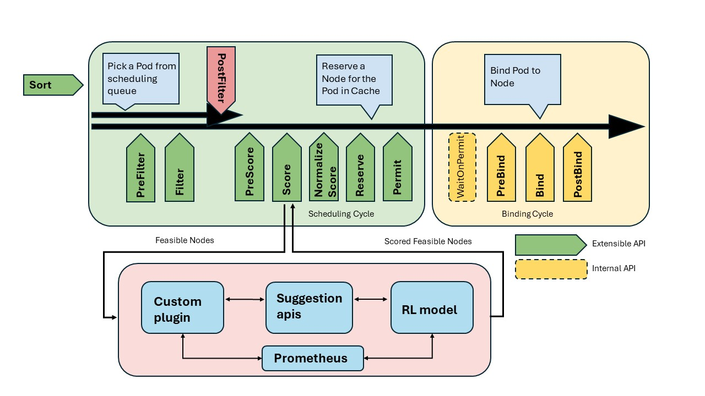
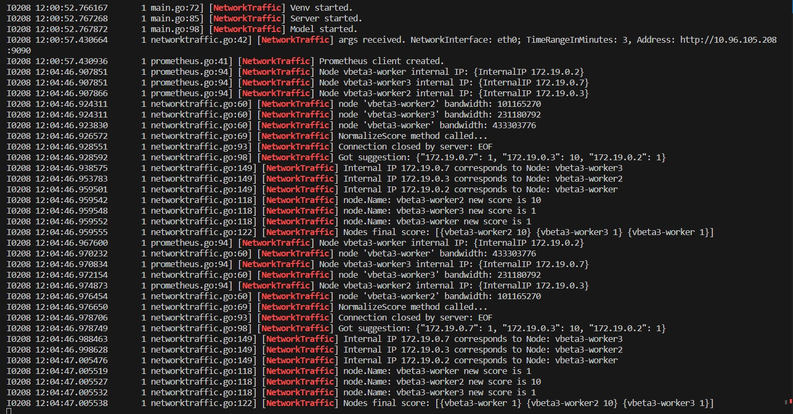

# "Orchestrating tasks in the cloud continuum with reinforcement learning"
### s302948 MATRANGA SONIA 

This thesis proposes and develops a new approach to scheduling within Kubernetes clusters. In particular, the proposed scheduler leverages a reinforcement-learning algorithm of type DQN by integrating a custom plugin used in the scoring phase of the scheduling chain, in order to optimize load distribution across available nodes with an innovative and intelligent approach.

The reinforcement-learning algorithm used in the plugin dynamically evaluates the available resources on the cluster nodes and, through reinforcement, learns to manage them by assigning a score to each node that reflects its suitability for hosting new pods. This intelligent evaluation thus provides a decision-making but also predictive tool to the scheduling system, which over time can make informed and increasingly better decisions about the optimal distribution of new workloads. The implementation has been tested in a Kind Kubernetes environment.

## Architecture

In the proposed solution, there are four fundamental communication units:

- Plugin: It intercepts the scoring phase and intervenes by requesting scheduling suggestions from the RL model, leveraging the exposed APIs.
- Suggestions server: It exposes the APIs to obtain scheduling suggestions.
- RL Model: It utilizes node metrics obtained from Prometheus to suggest on which node the new pod should be scheduled.
- Prometheus: It exposes various metrics collected on the nodes.



The communication between these elements occurs during the scoring phase, although the plugin can be extended to work on other phases if the extensible APIs are modified.

## Usage

To test the scheduler, you need to follow all the steps outlined below:

1. Setup Kind Cluster:
Create a Kind cluster with 4 nodes using the configuration file [kind-config.yaml](kind-config.yaml), , where the paths of the model and venv need to be correctly configured. Execute it with:

   ```kind create cluster --name vbeta3 --config kind-config.yaml ```

2. Configure Prometheus with Node Exporter:
Install Prometheus configured with Node Exporter into the cluster to provide metrics to the RL model. Follow the steps outlined in the article [kind-fix missing prometheus operator targets](https://medium.com/@charled.breteche/kind-fix-missing-prometheus-operator-targets-1a1ff5d8c8ad) to let prometheus work on a kind cluster.


## Scheduler 

La nuova immagine dello scheduler da creare nel cluster viene creata localmente tramite i file della directory [scheduler-plugins](scheduler-plugins), contenente il codice dei plugins contenuti nel repository [scheduler-plugins](https://github.com/kubernetes-sigs/scheduler-plugins) ai quali è stato aggiunto il custom plugin NetworkTraffic, che effettua lo scoring in base ai suggerimenti del modello di reinforcement learning.
Viene quindi creata l'immagine locale tramite il comando `make local-image` che andrà a creare una nuova immagine docker `localhost:5000/scheduler-plugins/kube-scheduler:latest`.
A questo punto l'immagine viene caricata sui nodi del cluster affinchè sia presente localmente nel nodo:

``` kind load docker-image --name  vbeta3 localhost:5000/scheduler-plugins/kube-scheduler:latest  ```

In alternativa può essere caricata in DockerHub se si modifica il file di configurazione kube-scheduler.yaml indicando al nodo master da dove scaricare l'immagine.

## Model

La directory model contiene l'agente di RL [cleanrl](https://docs.cleanrl.dev/) e il file `main.py` necessario per ottenere i suggerimenti dal modello nel plugin.

## Venv

Contiene il custom environment realizzato per poter usare l'agente all'interno del cluster Kind. In particolare è stata modificata la libreria gymnasium contenente il nuovo environment `scheduler.py` situato in:
`venv/lib/python3.9/site-packages/gymnasium/envs/classic_control`

## Configurazione scheduler nel master node
Dopo aver creato automaticamente il cluster, si aggiunge la configurazione del nuovo scheduler nel nodo master (control-plane del cluster):
- `etc/kubernetes/manifests`: copiare il file kube-scheduler.yaml contenente la nuova configurazione del pod scheduler creato a partire dall'immagine creata localmente
- `etc/kubernetes`: copiare i file networktraffic-config.yaml che contiene la configurazione dei plugin dello scheduler, da cui è possibile abilitare o disabilitare comportamenti di default

é necessario riavviare il control-plane e cancellare il pod scheduler per creare il nuovo scheduler con la configurazione corretta e l'immagine locale. Il pod scheduler può essere ricavato se si usa kubectl con il comando:
``` kubectl get pods -n kube-system ```
dal quale tra i pod si ottiene anche `kube-scheduler-vbeta3-control-plane` che  è il pod scheduler.

## Test di funzionamento

Il file nginx-deployment.yaml può essere eseguito per testare la schedulazione eseguendo:

```kubectl create -f nginx-deployment.yaml ```

Osservando i log dello scheduler è possibile osservarne il comportamento quando viene effettuata una nuova schedulazione:

 ```kubectl logs -f kube-scheduler-vbeta3-control-plane  -n kube-system | grep "NetworkTraffic ```

 Si ottiene un output simile per cui i pod sono schedulati sul nodo worker con score maggiore.




## File modificati

Directory model:
- `model/cleanrl`: contiene tutti i file [cleanrl](https://docs.cleanrl.dev/) che vanno montati sul pod scheduler
- `model/main.py`: contiene funzioni per esporre i suggerimenti dell'agente e per permettere la comunicazione tra il venv e prometheus
- altri file usati nelle precedenti versioni e runs generata da cleanrl

Directory scheduler-plugins:
- `scheduler-plugins/bulid/scheduler/Dockerfile`: dockerfile dello scheduler dal quale configuro l'installazione delle librerie per eseguire l'agente e attivo il venv
- `scheduler-plugins/cmd/sheduler/main.go`: avvia il modello e registra il custom plugin per lo scheduler
- `scheduler-plugins/pkg/networktraffic/networktraffic.go`: file che definisce il custom plugin
- `scheduler-plugins/pkg/networktraffic/prometheus.go`: funzioni di interazione tra custom plugine  prometheus nel caso in cui la comunicazione con l'agente dovesse fallire
- sono presenti modifiche a versioni di librerie per far funzionare correttamente le repo

Directory venv:
- `venv/lib/python3.9/site-packages/gymnasium/envs/classic_control/scheduling.py`: definizione dell'environment usato dall'agente dqn che si trova in model. Avvia anche app per visualizzare i grafici sull'agente.
- `venv/lib/python3.9/site-packages/gymnasium/envs/classic_control/__init__.py`:per registrare il nuovo environment custom in gymnasium
- `venv/lib/python3.9/site-packages/gymnasium/envs/classic_control/graph.py`: per gestire la creazione di grafici per valutare l'agente


File di configurazione:
- `kind-config.yaml`: configurazione iniziale del cluster sul quale va aggiunto prometheus
- `kube-scheduler.yaml`: configurazione del pod scheduler dove inserisco i volumi di pulgin, model e venv
- `networktraffic-config`: file di configurazione del custom scheduler da dove è possibile abliltare e disabilitare plugins e comportamenti di default dello scheduler e dove viene passato come argomenti l'address di prometheus.

 
 


